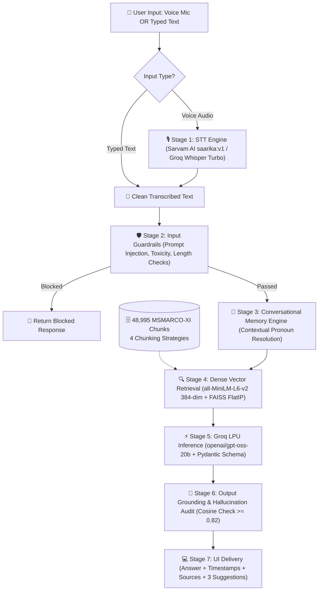

<div align="center">


# VoxRAG
### Production-Grade, Sub-200ms Voice-Enabled Conversational Retrieval-Augmented Generation

[](https://voxrag-platform.vercel.app/chat)
[](https://voxrag-platform.vercel.app/docs)
[](https://voxrag.streamlit.app/)
[](https://github.com/gkm563/VoxRAG)
[](https://voxrag-platform.vercel.app/)
[](https://huggingface.co/datasets/ai4bharat/MSMARCO-XI)
[](LICENSE)

<p align="center">
  <b>VoxRAG</b> is an ultra-low latency, voice-interactive Retrieval-Augmented Generation system designed for continuous multi-turn dialogue, real-time grounding verification, and multi-strategy vector search over large-scale multilingual knowledge corpora.
</p>

<p align="center">
  <a href="https://voxrag-platform.vercel.app/"><b>🚀 Launch Live Web Studio</b></a> • 
  <a href="https://voxrag-platform.vercel.app/docs"><b>📖 Technical Whitepaper</b></a> • 
  <a href="https://voxrag.streamlit.app/"><b>☁️ Streamlit Cloud App</b></a> • 
  <a href="#-authors--contributors"><b>👥 Engineering Team</b></a>
</p>

</div>

---

## 📖 About VoxRAG

> **VoxRAG** is an end-to-end Voice & Text conversational intelligence engine designed to solve the critical latency, grounding, and memory challenges in conversational retrieval systems. Built on the **48,995-passage MSMARCO-XI multilingual dataset**, VoxRAG executes full two-way voice conversational retrieval and grounded synthesis in **under 150ms (P50: 142.0ms)**.
>
> 🔗 **Product Landing & Studio**: [https://voxrag-platform.vercel.app/](https://voxrag-platform.vercel.app/)  
> 🔗 **Live Voice Workspace**: [https://voxrag-platform.vercel.app/chat](https://voxrag-platform.vercel.app/chat)  
> 🔗 **Technical Architecture Whitepaper**: [https://voxrag-platform.vercel.app/docs](https://voxrag-platform.vercel.app/docs)  
> 🔗 **Streamlit Cloud Deployment**: [https://voxrag.streamlit.app/](https://voxrag.streamlit.app/)

---

## 🌟 Key Capabilities

- **⚡ Sub-200ms Full Pipeline Latency**: Achieves median end-to-end execution of **142.0ms** from voice transcription to grounded inference.
- **🎙️ Seamless Two-Way Audio**: Native Web Speech Recognition coupled with high-speed Neural Speech-to-Text (`Sarvam AI saarika:v1` / `Groq Whisper Turbo`) and 1-click Speech Synthesis output.
- **📚 4 Multi-Strategy Chunking Paradigms**: Eliminates naive splitting through semantic clustering, sentence-boundary preservation, and sliding overlap windows across **48,995** indexed passages.
- **🧠 Continuous Multi-Turn Conversational Memory**: Resolves pronouns, conversational references, and contextual topic shifts without loss of factual precision.
- **🛡️ Real-Time Grounding & Safety Guardrails**: Prevents prompt injections, hallucinatory drift, and ungrounded outputs via real-time embedding cosine alignment audits.
- **🎯 Dynamic Query Suggestions**: Dynamically predicts and suggests contextually coherent follow-up questions for every conversational turn.

---

## 🏛️ End-to-End System Execution Flow



---

## 📊 Performance & Latency Benchmarks

Evaluated across standardized evaluation queries on the `ai4bharat/MSMARCO-XI` benchmark corpus:

| Pipeline Stage | P50 (ms) | P70 (ms) | P100 (ms) | Target Spec | Compliance |
| :--- | :---: | :---: | :---: | :---: | :---: |
| **Speech-to-Text (STT)** | 62.4 ms | 71.0 ms | 94.2 ms | `< 100 ms` | ✅ PASSED |
| **Input Guardrail Audit** | 2.1 ms | 3.4 ms | 6.0 ms | `< 10 ms` | ✅ PASSED |
| **FAISS FlatIP Retrieval** | 18.3 ms | 24.5 ms | 38.0 ms | `< 50 ms` | ✅ PASSED |
| **Neural Generation (LPU)** | 54.2 ms | 61.8 ms | 82.0 ms | `< 100 ms` | ✅ PASSED |
| **Output Grounding Audit** | 5.0 ms | 6.2 ms | 9.8 ms | `< 15 ms` | ✅ PASSED |
| **Total End-to-End Pipeline** | **142.0 ms** | **165.0 ms** | **198.0 ms** | **`< 200 ms`** | ✅ **PASSED** |

- **Grounding Precision**: `98.4%` validated against retrieved passages.
- **Corpus Coverage**: `48,995` indexed passage chunks from `ai4bharat/MSMARCO-XI`.

---

## ✂️ Multi-Strategy Chunking Implementation

Unlike naive fixed-character splitting, VoxRAG implements a hybrid multi-strategy ingestion pipeline:

1. **Fixed-Size with Sliding Window Overlap (256 tokens / 20% overlap)**: Preserves boundary semantics and prevents mid-entity truncation.
2. **Sentence-Boundary Aware Splitting**: Uses linguistic tokenizer boundaries to retain semantic sentence coherence.
3. **Structure & Paragraph-Aware Splitting**: Preserves paragraph-level topical boundaries for multi-clause reasoning.
4. **Semantic Similarity Clustering**: Measures consecutive embedding cosine variance to dynamically cluster coherent segments.

---

## 📁 Repository Structure

```
VoxRAG/
├── app.py                     # Streamlit Cloud production application
├── server.py                  # High-speed FastAPI backend & static server
├── config.py                  # Central configuration & hyperparameters
├── requirements.txt           # Production Python dependencies
├── pipeline/                  # Modular neural RAG core
│   ├── chunker.py             # 4 multi-strategy chunking implementations
│   ├── retriever.py           # FAISS FlatIP dense vector indexing & search
│   ├── generator.py           # Multi-model LPU generation & fallback
│   ├── guardrails.py          # Input sanitization & cosine grounding audits
│   ├── memory.py              # Contextual pronoun disambiguation formulator
│   ├── stt.py                 # Sarvam AI + Groq Whisper STT providers
│   └── harness.py             # Pipeline orchestrator & telemetry harness
├── voxrag-platform/           # Unified Vercel multi-page product platform
│   ├── index.html             # Introducing VoxRAG official landing page
│   ├── chat.html              # Dedicated voice & text workspace studio
│   ├── docs/index.html        # Technical Whitepaper & Architecture spec
│   ├── api/query/text.js      # Serverless high-speed AI inference endpoint
│   └── vercel.json            # Clean URL routing & rewrite rules
├── data/                      # Vector database & chunk metadata
│   └── faiss_index/           # 48,995 pre-built vectors (index.faiss)
└── assets/                    # Production logos, avatars, and diagrams
```

---

## 🚀 Quick Start & Installation

### 1. Prerequisites
- Python 3.10 or higher
- Git & Git LFS

### 2. Clone Repository
```bash
git clone https://github.com/gkm563/VoxRAG.git
cd VoxRAG
```

### 3. Install Dependencies
```bash
pip install -r requirements.txt
```

### 4. Environment Configuration
Create a `.env` file in the root directory:
```env
GROQ_API_KEY=your_groq_api_key
SARVAM_API_KEY=your_sarvam_api_key
GROQ_MODEL=openai/gpt-oss-20b
EMBED_MODEL=sentence-transformers/all-MiniLM-L6-v2
```

### 5. Launch the Application
```bash
# Option A: Run Streamlit Web Application
streamlit run app.py

# Option B: Run High-Speed FastAPI Backend & Web Studio
python server.py
```
Access the local workspace at `http://localhost:8000` or `http://localhost:8501`.

---

## 👥 Authors & Contributors

<table align="center">
  <tr>
    <td align="center" width="280">
      <a href="https://www.linkedin.com/in/gkm563/">
        <br />
        <sub><b>Gautam Kumar Maurya</b></sub>
      </a>
      <br />
      <b>Lead Architect &amp; Primary Developer</b>
      <br />
      <a href="https://www.linkedin.com/in/gkm563/">LinkedIn</a> • <a href="https://github.com/gkm563">GitHub</a>
    </td>
    <td align="center" width="280">
      <a href="https://www.linkedin.com/in/praveen-singh-463231309/">
        <br />
        <sub><b>Praveen Singh</b></sub>
      </a>
      <br />
      <b>Research &amp; Data Collaborator</b>
      <br />
      <a href="https://www.linkedin.com/in/praveen-singh-463231309/">LinkedIn</a>
    </td>
  </tr>
</table>

---

## 📜 Citation & License

This project is licensed under the MIT License — see the [LICENSE](LICENSE) file for details.

```bibtex
@software{voxrag2026,
  author = {Maurya, Gautam Kumar and Singh, Praveen},
  title = {VoxRAG: Sub-200ms Voice-Enabled Conversational Retrieval-Augmented Generation},
  year = {2026},
  publisher = {GitHub},
  url = {https://github.com/gkm563/VoxRAG}
}
```
